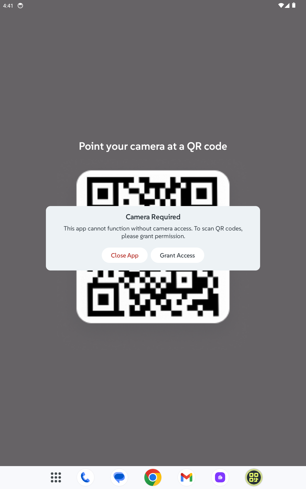

# 📷 QR Craft

**QRCraft** is a camera-first QR code scanning app built for the Mobile Dev Campus by [Phillip Lackner](https://pl-coding.com/campus) as part of the monthly challenge. This project is designed to deliver a fast, smooth scanning experience with adaptive layouts for mobile and larger screens.

---

## Project Status

This project is divided in 4 different milestones that are launched every fortnight.
We are currently working in **milestone 1**

### 🚨 Latest Features ###

- **Splash Screen**
    - Bright yellow QR Craft logo centered, edge-to-edge fill.
- **Main Scanning Screen**
    - Automatic camera permission request on launch
    - Live camera preview with scanning frame.
    - Modal dialog for denied permissions
    - Green snackbar confirmation when permission granted.
    - Real-time QR code detection.
    - Automatic navigation to Scan Result screen.
- **Scan Result Screen**
    - Displays detected QR code content with type recognition.
    - Special handling for long text with “Show more” / “Show less” toggle.
    - Share and Copy action buttons.
- **Adaptive Layouts**
    - Mobile (≤ 600dp) and wider screen (≥ 600dp) designs implemented per Figma mockups.

---

## 🧑🏽‍💻 Technical implementation

- ✅ Jetpack Compose.
- ✅ MVI architecture (multi-modularized).
- ✅ Compose Navigation.
- ✅ Koin dependency injection.
- ✅ Camera permission handling.
- ✅ Real-time QR scanning with Google ML Kit.
- ✅ Material Design 3 components and theming.
- ✅ Adaptive layouts for tablets and large screens.

---

## 🎥 Demo ##

https://github.com/user-attachments/assets/1e82793f-7c60-4a92-9957-5217cdcf9ada

## 📱 Screenshots ##

### Camera Permission ###

| Mobile                                                             | Tablet                                                              | 
|--------------------------------------------------------------------|---------------------------------------------------------------------|
|  |  | 

### Camera Screen ###

| Mobile                                                         | Tablet                                                          | 
|----------------------------------------------------------------|-----------------------------------------------------------------|
|  |  | 

### Scan Result Screen ###

| Mobile                                                         | Tablet                                                          | 
|----------------------------------------------------------------|-----------------------------------------------------------------|
|  |  | 

---

## License

MIT License

Copyright (c) 2025 Galah & Invoke

Permission is hereby granted, free of charge, to any person obtaining a copy
of this software and associated documentation files (the "Software"), to deal
in the Software without restriction, including without limitation the rights
to use, copy, modify, merge, publish, distribute, sublicense, and/or sell
copies of the Software, and to permit persons to whom the Software is
furnished to do so, subject to the following conditions:

The above copyright notice and this permission notice shall be included in all
copies or substantial portions of the Software.

THE SOFTWARE IS PROVIDED "AS IS", WITHOUT WARRANTY OF ANY KIND, EXPRESS OR
IMPLIED, INCLUDING BUT NOT LIMITED TO THE WARRANTIES OF MERCHANTABILITY,
FITNESS FOR A PARTICULAR PURPOSE AND NONINFRINGEMENT. IN NO EVENT SHALL THE
AUTHORS OR COPYRIGHT HOLDERS BE LIABLE FOR ANY CLAIM, DAMAGES OR OTHER
LIABILITY, WHETHER IN AN ACTION OF CONTRACT, TORT OR OTHERWISE, ARISING FROM,
OUT OF OR IN CONNECTION WITH THE SOFTWARE OR THE USE OR OTHER DEALINGS IN THE
SOFTWARE.

## Acknowledge

- Learned and implemented adaptive layouts for different screen sizes.
- Gained experience integrating camera APIs with real-time QR code detection.
- Applied structured content type detection for better user experience

---
